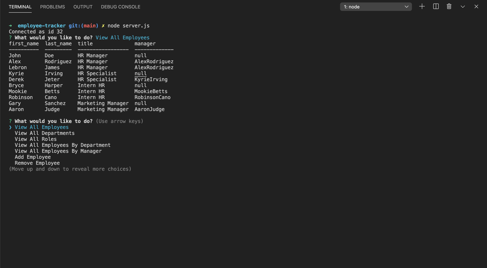
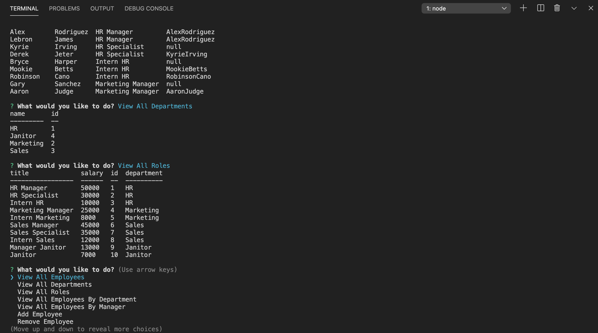

  ### Employee Tracker 
  ### https://github.com/alexreveles@yahoo.com
  ## Description
  This application was designed to view and manage the departments, roles, and employees in any company needed to not only be but stay organize and plan for the business.
  ##  Table of Contents
  * [Installation](#installation)
  * [Usage](#usage)
  * [License](#License)
  * [Contributing](#contributing)
  * [Tests](#Tests)
  * [Questions](#questions)
  ## Installation
  The dependencies are necessary to be installed to be able to run the application.
  ## Usage
  In order to run this application, To run this application you must run it in the terminal and use the command "node server.js" to allow the prompts to popullate.
  
  # License
  This project is  licensed MIT license.
  
  ## Contributing
  Contributors: Alex Reveles
  ## Test
  The following is needed to run the test: node server.js
  ## Questions
  If you have any questions regarding about the application, please contact me alexreveles@yahoo.com

### https://youtu.be/_J_fQC6KZ9E
### https://github.com/alexreveles/employee-tracker
### https://github.com/alexreveles

